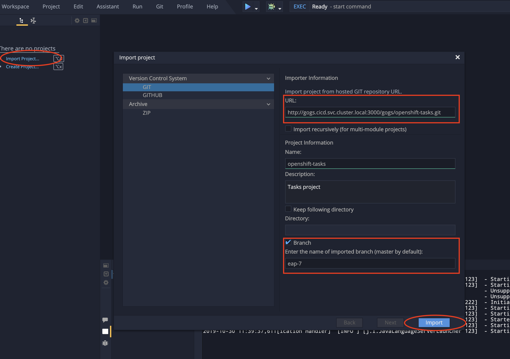
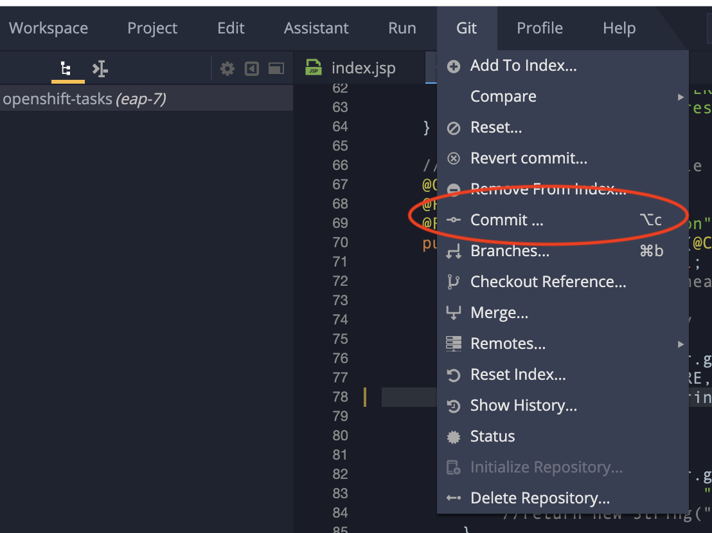
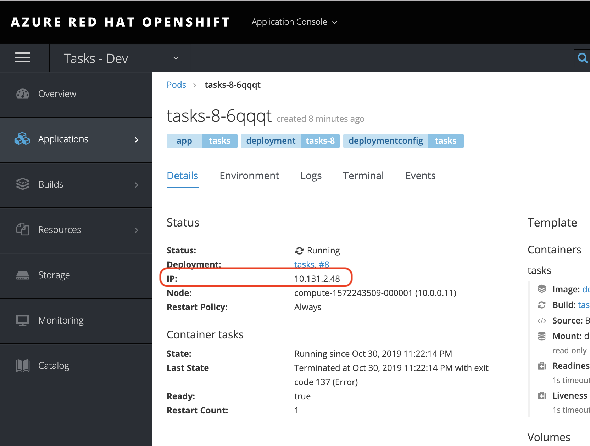

= Code Ready Workspace Demo Script

.Demo Resources
****
Prior to running this demo, the following things should exist:

* a cluster with CodeReady workspaces should already be installed (follow this information link:https://www.eclipse.org/che/docs/che-7/introduction-to-eclipse-che/[here] on a cluster with admin rights)
----
$  chectl server:start --platform=openshift --installer=operator --domain=apps.cloes.openshifttc.com -n dotnet-workspace
  ✔ Verify Kubernetes API...OK (it's OpenShift)
  ✔ 👀  Looking for an already existing Che instance
    ✔ Verify if Che is deployed into namespace "dotnet-workspace"
      ✔ Found running che deployment
      ✔ Found running postgres deployment
      ✔ Found running keycloak deployment
      ✔ Found running plugin registry deployment
      ✔ Found running devfile registry deployment
    ✔ Check Che server status...RUNNING (auth enabled)
  ✔ ✅  Post installation checklist
    ✔ Retrieving Che Server URL...http://che-dotnet-workspace.apps.cloes.openshifttc.com
    ✔ Che status check
Command server:start has completed successfully.
----
* link:scripts/01-project-setup.sh[This script] should have been run from within a terminal that has access to the openshift cluster
----
$ scripts/01-project-setup.sh coles-demo
----
* A code ready workspace should already be configured ("prepared earlier") in the "dotnet-workspace" project that is based on link:che/Devfile.yml[this DevFile.yml]

* Two users should already be registered with the email addresses:
** mhildenb@redhat.com
** brbaker@redhat.com
****

== Setting the Scene

For the conceit of this demo, Tasks is an application that you would like to have managed by remote teams or temporary staff, thus making RedHat's CodeReady Workspaces an appealing option.

Marc manages a team of temporary (or remote) developers, and Bryon is one of those remote developers.  In this demo Marc and his remote developers are maintaining a number of _dotnet core 2.2_ microservices under OpenShift (see <<Technical Context>>)

In this demo, you will see

* Creation of a new Open Code Ready Workspaces
* Features of the IDE
** Values COntroller: show quickfix: remove unnecessary using
* Group editing functionality
* Building and debugging
* Revision Control integration (git)
* Integration with Azure Pipelines
* Bonus: Custom Stack definitions

== Technical Context

First we want to give some context to the toy application and environment that we've set up.

image:../images/acme-diagram.png[]

Pretend we have a company that allows customers to access their profile, save preferences, and have those preferences fed into a recommendation service that attempts to determine recommendations based on preferences.

Currently our Customer service does not connect to our preferences service.  We are going to change that and deploy a new version of the service using CodeReady Workspaces and Azure Pipelines

== Build and Deployment Chain

image:../images/acme-development.png[]

Some points to highlight:

* *DockerHub* can be replaced with any image registry service or even an image stream within OpenShift

* *GitHub Repo* can be replaced with just about any repo, including a Gogs lightweight GitHub repo that can reside within OpenShift and _not be accessible to the outside at all_ for utmost security of said repos

* *Namespaces* we have 2 different projects (or namespaces) within OpenShift
** dotnet-workspace: This is meant to represent where all our CodeReady Workspaces will be managed within OpenShift
** coles-demo: This is where the actual microservice containers will live

== Installing CodeReady Workspaces

====
1. Download the CodeReady Workspace installer from link:access.redhat.com[]
2. _Optional:_ Change storage to be per-workspace
3. Run the deploy script to install CRW in demo-workspaces
----
./deploy.sh —deploy -p=demo-workspaces \
    --operator-image=registry.redhat.io/codeready-workspaces/server-operator:1.0 \
    --server-image=registry.redhat.io/codeready-workspaces/server-rhel8:1.2
----
NOTE: This installs an *Operator* which in turn installs all the required components for CRW.  It will take a few minutes to setup.  At this point, you could switch to a CRW you prepared earlier
====

1. Open the OpenShift console in a tab
* user: kubeadmin
* password: mQfyp-zURPC-thsS8-b7Pv3
2. Select the "dotnet-workspace" project, then click on Routes, then find the link:http://che-dotnet-workspace.apps.cloes.openshifttc.com/dashboard/#/["che" route]
image:../images/find-crw-dashboard.png[]

3. When prompted, login (or register)
4. Go to workspaces and click the play button on the "dotnet"
workspace.  While that loads, do a tour of stack creation

====
4. Click on Create Workspace and fill in as shown below. 

image:../images/crw-create-workspace.png[]

INFO: git repo is _https://github.com/hatmarch/codeready-dotnet-2.2.git_

5. When done, click the dropdown to reveal "Create and Proceed Editing"

image:../images/crw-create-and-proceed.png[]

6. Edit the workspace
* Overview: Set the name
* Projects: point out the git repo
* Plugins: Note the omnisharp plugin (based on extensions)
* Editors: Theia
* Devfile: See link:che/Devfile.yml[this Devfile.yml] in the project and paste in the launch.conf and tasks
* Share: We'll show that in a minute

7. *_Don't_* click Open.  Once the dotnet workspace stops, you can abandon this workspace
====

6. From the Workspaces tab, click the gear icon on the right of the entry for the dotnet workspace  

7. Click Share and then Add Developer, fill in as below and click save
image:../images/crw-share.png[]

== Edit the project

TODO: KEEP GOING
* typo and build
* Bryon edit preference url
* command shortcuts
* console build
* run

* debug
* set breakpoint

1. Create a new JBoss workspace
2. In a separate tab, open the route to the gogs workspace
* Point out the service route of the gogs workspace
* replace the clone http route with the service name of the route
----
http://gogs.cicd.svc.cluster.local:3000/gogs/openshift-tasks.git
----
3. Open the new workspace
4. Click on Import Project

5. Configure as Maven

image::../images/project-configuration.png[]

6. Go to Configure workspace

image::../images/configure-workspace.png[]

7. Go to the workspaces view and share with brbaker@redhat.com

image::../images/share-workspace.png[]

== Edit the code

1. Open *index.jsp*.  Open the file by navigating to it (from assistant menu)

image::../images/navigate-to.png[]

2. Find and Replace "OpenShift Tasks" with "Azure Red Hat Openshift Tasks"
3. Navigate to: *DemoResource.java*
4. _Watch_ Bryon make the following changes to the *toggleHealth* method:

====
image::../images/toggle-health-delta.png[]
====

== Compile the code

1. Build the project by using the maven build command (from UI)

image::../images/build-success.png[]

====
TODO: Fill this in!
====

== Commit the code

1. Open Git window by going to Git > Commit

2. Make sure the changes are selected, enter a commit message, and click commit (_note: don't push to origin yet_)

3. Shrink the existing tab and in a new window (Window #2), go to the *CI/CD* project in OpenShift.
* Select the Build > Pipelines option on the right in Window #2
====

====

4. In Window #1, open the terminal, navigate to the project directory, and push to origin
----
$ cd 
$ git push origin
Enumerating objects: 17, done.
Counting objects: 100% (17/17), done.
Delta compression using up to 4 threads.
Compressing objects: 100% (7/7), done.
Writing objects: 100% (9/9), 754 bytes | 754.00 KiB/s, done.
Total 9 (delta 2), reused 0 (delta 0)
Username for 'http://gogs.cicd.svc.cluster.local:3000': gogs
Password for 'http://gogs@gogs.cicd.svc.cluster.local:3000':
To http://gogs.cicd.svc.cluster.local:3000/gogs/openshift-tasks.git
   3c27c77..0150cfc  eap-7 -> eap-7
----

5. Navigate to the Tasks - Dev route.  Play with the app
* Notice the issue where you don't get a message when toggling back to healthy

image::../images/tasks-dev-broken.png[]

== Debugging the container

There is clearly an issue that we're not getting a message whenver we toggle health.  We need to debug this issue.

WARNING: You need to ensure the DeploymentConfig for the Tasks pod has JAVA_OPTS that include the debugger flags

1. Navigate to *DemoResource.java* and set a breakpoint on line 71 by clicking on the number
2. Window #2> In a new tab of this window, look up the IP address of one of the running containers
* Open the "Tasks - Dev" project
* Go to Application > Pods
* Select the running tasks pod and look at the details.  Find the IP address of the pod

3. Go to the CodeReady Workspace and select Run > Edit Debug Configuration
4. Using IP address, update the Debug Configuration per this image:

image::../images/remote-debug-configuration.png[]

5. Click Save, then click Debug
* Notice the Debug "perspective" in the workspace window

6. In Window #2, click on Toggle Health
* You should show up in the debugger in Window #1

7. Demonstrate stepping functionality, watch window, and stack trace.
8. Fix the code and recommit and deploy from the command line
----
$ git add .
$ git commit -m "Fix toggleHealth"
$ git push origin
----

== Promote to Staging

1. Make sure Window #2 is set to Build > Pipelines on the commit from last section
2. Wait until "Promote to STAGE?" lights up so you can click it
* NOTE: If you miss it, just click the *Start Pipeline* button in the corner

== Post Mortem

1. Static Analysis Warned us!

image::../images/sonarqube-code-smells.png[]
