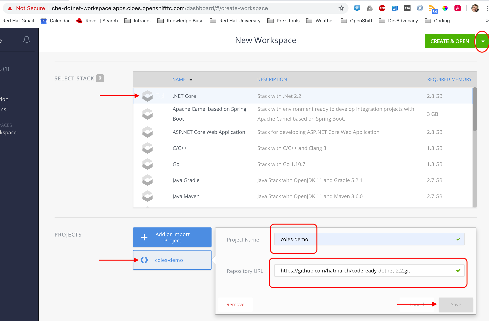
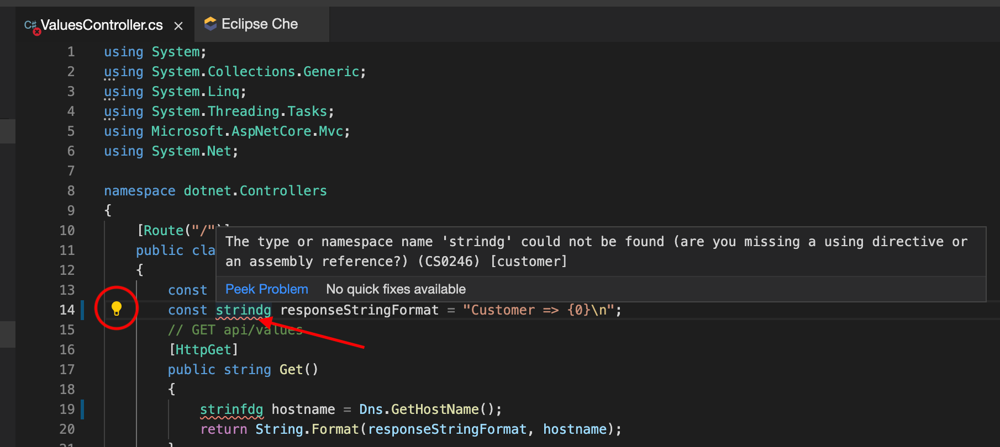

= Code Ready Workspace Demo Script

.Demo Resources
****
Prior to running this demo, the following things should exist:

* a cluster with CodeReady workspaces should already be installed (follow this information link:https://www.eclipse.org/che/docs/che-7/introduction-to-eclipse-che/[here] on a cluster with admin rights)
----
$  chectl server:start --platform=openshift --installer=operator --domain=apps.cloes.openshifttc.com -n dotnet-workspace
  ✔ Verify Kubernetes API...OK (it's OpenShift)
  ✔ 👀  Looking for an already existing Che instance
    ✔ Verify if Che is deployed into namespace "dotnet-workspace"
      ✔ Found running che deployment
      ✔ Found running postgres deployment
      ✔ Found running keycloak deployment
      ✔ Found running plugin registry deployment
      ✔ Found running devfile registry deployment
    ✔ Check Che server status...RUNNING (auth enabled)
  ✔ ✅  Post installation checklist
    ✔ Retrieving Che Server URL...http://che-dotnet-workspace.apps.cloes.openshifttc.com
    ✔ Che status check
Command server:start has completed successfully.
----
* link:scripts/01-project-setup.sh[This script] should have been run from within a terminal that has access to the openshift cluster
----
$ scripts/01-project-setup.sh coles-demo
----
* A code ready workspace should already be configured ("prepared earlier") in the "dotnet-workspace" project that is based on link:../che/Devfile.yml[this DevFile.yml]
** See <<Resetting CodeReady Workspace>> if there is one that needs to be restored

* Two users should already be registered with the email addresses:
** mhildenb@redhat.com
** brbaker@redhat.com

* Have VSCode open locally (on master branch)
** For access to templates and restart script if needed

* Setup the following tabs on the *hidden (demo driving) browser*
** link:file:///Users/marc.hildenbrand/Documents/Development/codeready-dotnet-2.2/docs/demo-script.adoc[DemoScript]
** link:https://mhildenb-public-stuff.s3-ap-southeast-2.amazonaws.com/Demo.html[LoginCredentials]

* Setup the following tabs on the *visible browser*
** link:file:///Users/marc.hildenbrand/Documents/Development/codeready-dotnet-2.2/docs/demo-script.adoc[Demo Script]: For showing the architecture
** link:http://customer-v2-coles-demo.apps.cloes.openshifttc.com/[Customer Endpoint]: For showing changes to deployed customer service
** link:https://console-openshift-console.apps.cloes.openshifttc.com/k8s/ns/dotnet-workspace/routes[OpenShift Console]: Optional> For showing the workspace running on openshift
** link:http://che-dotnet-workspace.apps.cloes.openshifttc.com/dashboard/#/[CodeReady Workspace Dashboard]: 
** link:https://dev.azure.com/mhildenb/coles-demo/_build[Azure DevOps]: To show the DevOps Pipeline home
****

== Setting the Scene

For the conceit of this demo, Tasks is an application that you would like to have managed by remote teams or temporary staff, thus making RedHat's CodeReady Workspaces an appealing option.

Marc manages a team of temporary (or remote) developers, and Bryon is one of those remote developers.  In this demo Marc and his remote developers are maintaining a number of _dotnet core 2.2_ microservices under OpenShift (see <<Technical Context>>)

In this demo, you will see

* Creation of a new Open Code Ready Workspaces
* Features of the IDE
** Values COntroller: show quickfix: remove unnecessary using
* Group editing functionality
* Building and debugging
* Revision Control integration (git)
* Integration with Azure Pipelines
* Bonus: Custom Stack definitions

== Technical Context

First we want to give some context to the toy application and environment that we've set up.

Pretend we have a company that allows customers to access their profile, save preferences, and have those preferences fed into a recommendation service that attempts to determine recommendations based on preferences.

Currently our Customer service does not connect to our preferences service.  We are going to change that and deploy a new version of the service using CodeReady Workspaces and Azure Pipelines

== Build and Deployment Chain

Some points to highlight:

* *DockerHub* can be replaced with any image registry service or even an image stream within OpenShift

* *GitHub Repo* can be replaced with just about any repo, including a Gogs lightweight GitHub repo that can reside within OpenShift and _not be accessible to the outside at all_ for utmost security of said repos

* *Namespaces* we have 2 different projects (or namespaces) within OpenShift
** dotnet-workspace: This is meant to represent where all our CodeReady Workspaces will be managed within OpenShift
** coles-demo: This is where the actual microservice containers will live

== Initial State

Check that the original customer service is up.  It should not connect to any of the other services.

Link should be link:http://customer-v2-coles-demo.apps.cloes.openshifttc.com/[here]

== Installing CodeReady Workspaces

====
1. Download the CodeReady Workspace installer from link:access.redhat.com[]
2. _Optional:_ Change storage to be per-workspace
3. Run the deploy script to install CRW in demo-workspaces
----
./deploy.sh —deploy -p=demo-workspaces \
    --operator-image=registry.redhat.io/codeready-workspaces/server-operator:1.0 \
    --server-image=registry.redhat.io/codeready-workspaces/server-rhel8:1.2
----
NOTE: This installs an *Operator* which in turn installs all the required components for CRW.  It will take a few minutes to setup.  At this point, you could switch to a CRW you prepared earlier
====

1. Open the OpenShift console in a tab
* user: kubeadmin
* password: mQfyp-zURPC-thsS8-b7Pv3
2. Select the "dotnet-workspace" project, then click on Routes, then find the link:http://che-dotnet-workspace.apps.cloes.openshifttc.com/dashboard/#/["che" route]
image:../images/find-crw-dashboard.png[]

3. When prompted, login (or register)
4. Go to workspaces and click the play button on the "dotnet"
workspace.  While that loads, do a tour of stack creation

====
4. Click on Create Workspace and fill in as shown below. 

INFO: git repo is _https://github.com/hatmarch/codeready-dotnet-2.2.git_

5. When done, click the dropdown to reveal "Create and Proceed Editing"

6. Edit the workspace
* Overview: Set the name
* Projects: point out the git repo
* Plugins: Note the omnisharp plugin (based on extensions)
* Editors: Theia
* Devfile: See link:che/Devfile.yml[this Devfile.yml] in the project and paste in the launch.conf and tasks
* Share: We'll show that in a minute

7. *_Don't_* click Open.  Once the dotnet workspace stops, you can abandon this workspace
====

6. From the Workspaces tab, click the gear icon on the right of the entry for the dotnet workspace  

7. Click Share and then Add Developer, fill in as below and click save

== Edit the project

Explain that this is a simple dotnet MVC project.  We're going to look at the ValuesController which handles the mapping for /.  We're going to start there because we want the customer module to be able to call the Preferences module

1. If prompted to restore packages, then do so first
2. Open the ValuesController by using the shortcut CMD+p
* also point out the familiar project explorer on the left
2. Create a typo and show the continuous linting 

NOTE: If the errors do not appear right away, start a build by going to Terminal > Tasks and then selected build when prompted.  If the IDE still appears unresponsive, then see <<Unresponsive IDE>> in the <<Troubleshooting>> section

3. Click on the lightbulb and select fix typo

4. If you haven't already, kick off a build by selecting Terminal > Run Task... and then select build

5. Ask assistant (Bryon) to log into the code ready workspace link:http://che-dotnet-workspace.apps.cloes.openshifttc.com/dashboard/#/ide/mhildenb/dotnet[here] and ask him to change the value of url to:
* const string url = "!http://preference.coles-demo.svc.cluster.local:8080"
* this ! at the start will cause a problem

6. Meanwhile, demonstrate editing features whilst Bryon is making changes (_see also link:templates/Template_ValuesController.cs[Template_ValuesController.cs] in the templates directory_)
* show the remove unnecessary usings
* show auto complete/intellisense
* show mutli-select (e.g. select callPreference and use ctrl-d to select all occurrances of this and change to callPreferenceService)

== Using the Terminal

1. Open the terminal by going to Terminal > Open Terminal in specific container and then select the name of the workspace (there will usually only be one choice)

2. Once the console is opened, type the following to build the changes 
----
$ cd coles-demo
$ dotnet build
Microsoft (R) Build Engine version 16.2.32702+c4012a063 for .NET Core
Copyright (C) Microsoft Corporation. All rights reserved.

  Restore completed in 63.24 ms for /projects/coles-demo/customer.csproj.
  customer -> /projects/coles-demo/bin/Debug/netcoreapp2.2/customer.dll

Build succeeded.
    0 Warning(s)
    0 Error(s)

Time Elapsed 00:00:03.78
----

3. _optional_ Whilst there show that the terminal has access to whatever programs were included in the dockerfile that created the workspace.  Try curling the preference endpoint _pointing out that this url is not available outside the cluster!_
----
$ curl http://preference.coles-demo.svc.cluster.local:8080
preference => recommendation v1 from '69d8cd757c-hm94x': 1
----

== Debugging
1. Go to the debug panel and click "play"

2. You will be prompted to redirect port output and open a window.  Say yes to both
3. Refresh the window and eventually it will come up with a result (_but not the one that we want_)

image:../images/che-run.png[]

4. Let's set a breakpoint at the start of callPreference to see what's going on
* show call-stack and variables
* show hover over to show value of variable

5. concluding that the issue is a typo in the url, correct the url line accordingly

----
const string url = http://preference.coles-demo.svc.cluster.local:8080
----

6. Build the project and then run the debugger again to test that it's working correctly.

== Testing

There is a special test panel available (as it is in VSCode) that can be accessed from the View > Test menu

WARNING: Due to time contraints we can't show the testing functionality at this time

== Checking in

Now that we're confident that our code is working we're going to  check it into our git repo which will trigger an Azure pipeline (which we'll take a tour of after checkin)

1. *Command line* you can run the git command from the command line
----
$ git status
On branch feature-trigger
Your branch is up-to-date with 'origin/feature-trigger'.
Changes not staged for commit:
  (use "git add <file>..." to update what will be committed)
  (use "git checkout -- <file>..." to discard changes in working directory)

        modified:   Controllers/ValuesController.cs

no changes added to commit (use "git add" and/or "git commit -a")
----

2. You can also access the git panel from within the IDE.  Let's use it to stage our changes and make a commit message.

3. *Preview* the changes by double clicking on the Values controller

3. Once you have a commit message written, press the check box to commit the change.  

4. To trigger the build, we need to push this branch to the repo which we can also do through the gui as follows:

5. When prompted for login details, use details on link:https://mhildenb-public-stuff.s3-ap-southeast-2.amazonaws.com/Demo.html[this page]

== Continuous Integration (Azure DevOps Pipeline)

You can open Azure DevOps window link:https://dev.azure.com/mhildenb/coles-demo/_build[here]

There are a couple of pre-requisites that need to be setup with Azure DevOps.  These can be found under Project Settings (and refer back to the images from the beginning of the script)

A. *OpenShift* There is the OpenShift service connector (that is installed from the marketplace).
* for more information on this, see link:https://github.com/redhat-developer/openshift-vsts/blob/master/docs/getting-started.md[this link]
B. *Docker Registry* This is the connection to the image registry (dockerhub in this instance, but can be any docker registry) for storing images
C. *Git Repo* This is an integration with GitHub for triggering builds and pulling down the source code to make the build artifact

=== Pipeline

Once we push to the git repo, we can open our corresponding Azure DevOps pipeline link:https://dev.azure.com/mhildenb/coles-demo/_build[here].

1. Show the Pipelines view and that a build has been triggered

image:../images/pipelines-view.png[]

2. Tour the different point of the job

A. *Trigger* This build is triggered only on checkin to this github repo on this branch
B. *Build* Script that controls the building of the artifacts of this project
C. *Docker* Creation of the docker image, notice the version number
D. *Artifacts* Artefacts that get passed to the release pipeline.  In this case, the YAML file is the most critical

=== Release

Now navigate to the release side link:https://dev.azure.com/mhildenb/coles-demo/_release?_a=releases&view=mine&definitionId=1[here]

1. Review this overview

2. Let's take a look at those scripts by clicking the "Wdit" button highlighted above and then "Edit Release"

image:../images/azure-release-detail-1.png

 3. Talk about the YAML token replace (on link:/workspaces/codeready-dotnet-2.2/azure-pipelines.yml[this] deployment

4.  Integration with OpenShift

Notice the service connection and the use of variables for creating a deployment yaml and then applying it to the cluster in the proper namespace.

== Verify Deployment

Here's the final deployment of the customer:

== Troubleshooting

=== Resetting CodeReady Workspace

==== In Git
1. Using Fork, delete the feature-trigger branch from the origin repo in GitHub
2. Recreate the feature-trigger branch on commit 89c63
3. Push the changes to origin (github)

==== In CodeReady Workspace
1. Open a terminal
2. In the terminal, run the following
----
$ rm -rf coles-demo
$ git clone --branch feature-trigger https://github.com/hatmarch/codeready-dotnet-2.2.git coles-demo
----

3. You can optionally store your login credentials (use a token) running these commands from the terminal
----
$ cd /projects/coles-demo
$ git config credential.helper store
$ git config --global credential.helper 'cache --timeout 7200'
$ git push
Username for 'https://github.com': hatmarch
Password for 'https://hatmarch@github.com': 
Everything up-to-date
$ git push
Everything up-to-date
----

=== Unresponsive IDE

If the IDE or debugger fail to start, attempt this:

1. (_In a shell where you are logged in with edit rights to the dotnet-workspace project_) run link:scripts/01-project-setup.sh[this script] to restart the che server.  
2. The script will watch the deployments and print them to the screen.  Hit ctrl-C once it shows that the che pod is available again

----
$ scripts/util-restart-che-server.sh
NAME   READY   UP-TO-DATE   AVAILABLE   AGE
che    0/1     1            0           16h
che   1/1   1     1     16h
----
3. Refresh the browser that was pointing to the workspace.  It should come back up quickly

